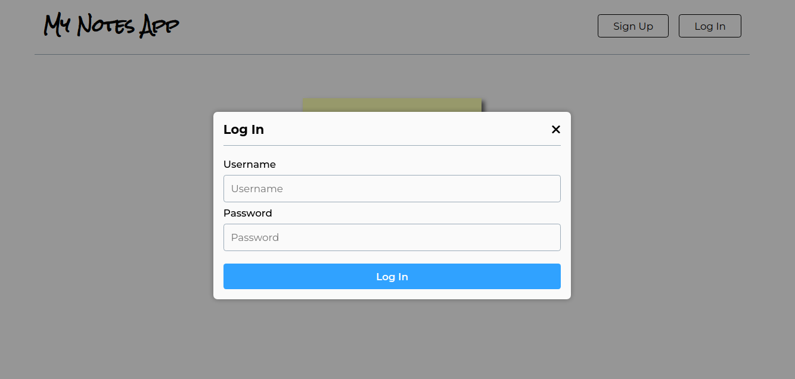
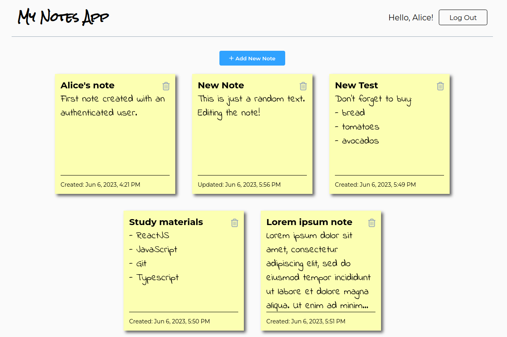

# Notes App

---

Full-stack web app developed using React and TypeScript for the frontend and Node.js with Express.js as the backend framework. The application utilizes a MongoDB database hosted on **Atlas**.

The app provides users with the ability to create, edit, and delete notes, but requires authentication to access these features. Users are required to log in before they can start managing their notes.

The frontend is built with React and TypeScript. The backend utilizes Node.js and Express.js to handle API requests and interact with the MongoDB database.

#### Main Features
- **Session Management**: The app utilizes session-based authentication. When a user submits a login request, the server authenticates the credentials, creates a session in the Atlas database, and returns a cookie containing the session ID to the user. This functionality is implemented using the `express-session` library, ensuring a secure session-based authentication process.
- **Password security**: Password security is a top priority in the app, and it is achieved by utilizing the `bcrypt` library. The raw password is never stored directly. Instead, bcrypt hashes and salts the password, providing a robust layer of protection against unauthorized access.
- **Form validation**:The app employs `React Hook Form` library for validating login and signup forms. With this library, various validation rules can be easily implemented. For example, the form does not allow empty fields upon submission and enforces specific criteria for the password, such as a minimum length of 8 characters and at least one uppercase character.
- **HTTP errors**: HTTP errors are effectively handled on the backend using the `HTTP-errors` library. This library simplifies the process of generating and managing HTTP errors, ensuring proper error handling and consistent responses to client requests.
- **Responsive Design**: The app features a responsive design, allowing it to adapt seamlessly to different devices.

#### Main Frontend Dependencies

- [Font Awesome](https://fontawesome.com/v5/docs/web/use-with/react)
- [React Hook Form](https://www.react-hook-form.com/)

#### Main Backend Dependencies

- [Bcrypt](https://www.npmjs.com/package/bcrypt)
- [Cors](https://github.com/expressjs/cors)
- [Dotenv](https://www.npmjs.com/package/dotenv)
- [Envalid](https://npm.io/package/envalid)
- [Express](https://expressjs.com/)
- [Express-session](https://www.npmjs.com/package/express-session)
- [HTTP-errors](https://www.npmjs.com/package/http-errors)
- [Mongoose](https://www.npmjs.com/package/mongoose)
- [Morgan](https://www.npmjs.com/package/morgan)

#### How to run the project locally:

- To run the project locally, clone the repository (`git clone <repo_url>`). 
- Install first the backend dependencies and then the frontend dependepencies using the package manager of your choice (for example use `npm install`).
- Start the backend server: `npm start`
- Start the frontend development server: `npm start`

#### Technologies Used
- Typescript
- React
- HTML / pure CSS
- Node.js / Express.js
- MongoDB